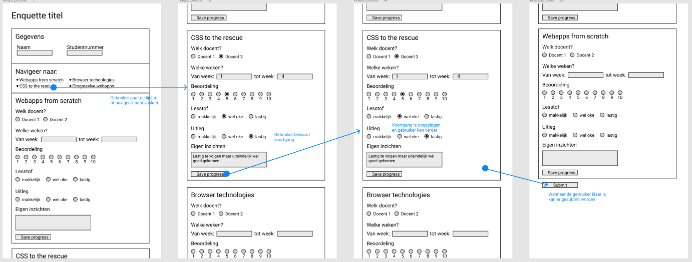
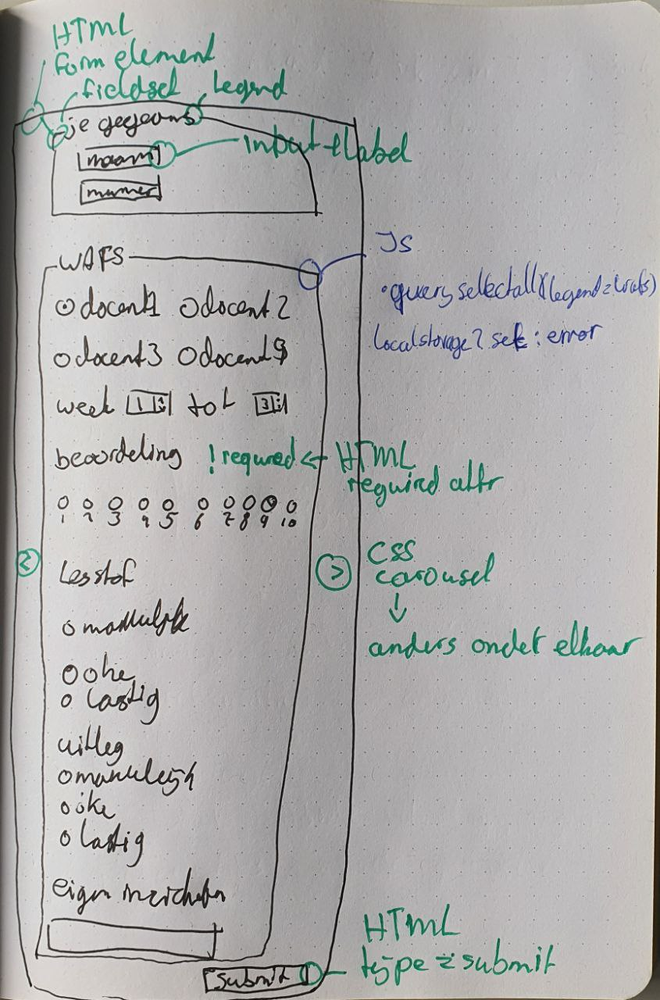
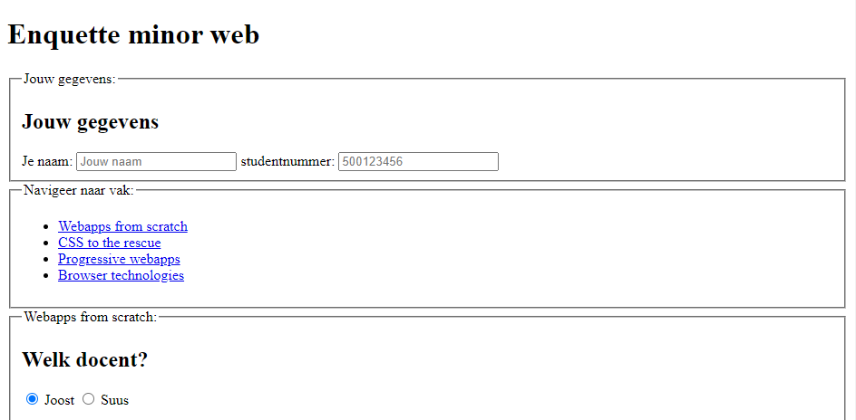
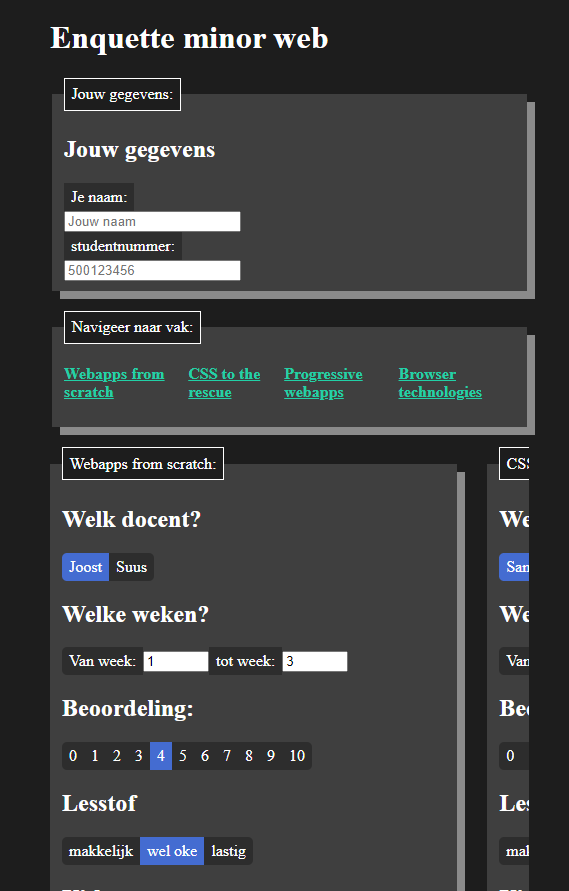
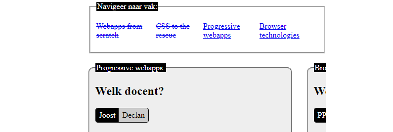

# Browser Technologies @cmda-minor-web 20-21

## Demo

- [Live demo](#)

## Concept
Voor dit vak, maak ik een enquette dat waar de gebruiker vakken gedurende de minor in kan vullen. De gebruiker wilt met gemak de enquette invullen en indien beschikbaar, de UX verbeteren met enchancements

### Core functionality

Mijn core functionaliteit is het invullen van een enquette. Deze wordt ondersteund met een server waar de gegevens opgeslagen wordt voor submittion of herstellen van de voortgang.

### Wireflow

### Breakdown

## Enhancements

### Functional
Er wordt een `<form>` weergeven met daarin `<fieldset>` waarin de invulvelden van de vakken in staan. De gebruiker kan er dan doorheen scrollen en invullen.

### Usable
Desondanks de `<fieldset>` een goed onderscheid maakt tussen de vakken, is het fijn om op slechts 1 vak per keer te focussen. Met CSS worden de vaken naast elkaar geplaatst als een carousel waarin de gebruiker door per vak kan kiezen.

### Pleasurable 
Om de ervaring helemaal compleet te maken, wordt de overbodige interactie overgenomen met javascript. De gebruiker hoeft niet meer op submit te klikken, de website merkt wanner alles ingevuld is en doet deze automatisch. Daarnaast laat het ook de voorgang zien door de voltooide vakken weg te strepen.

## Browser testing

| Feature | Chrome | Chrome android | Firefox | Firefox android |
| ------- | ------ | -------------- | ------- | --------------- |
| Feature | ✅     |                |         |                 |
| Feature | ❌     |                |         |                 |
| Feature | ✅     |                |         |                 |

## Enhancements
1. Custom validity messages met javasctipt
2. Input velden met patterns ondersteunen met CSS (in)valid
3. Een carousel ontwerp waarbij slecht een van per keer te zien is.