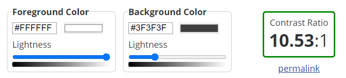
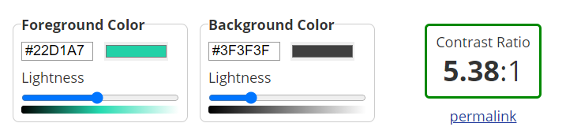
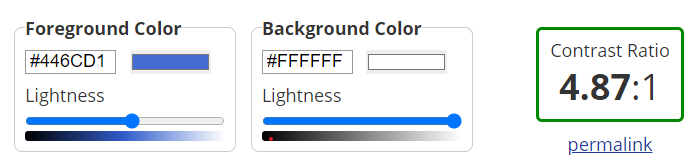
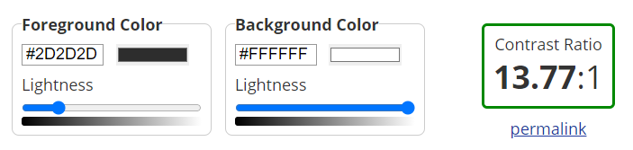

# Browser Technologies @cmda-minor-web 20-21

## Demo

- [Live demo](https://browser-technologies-2021.herokuapp.com/)
! hosting bewaart geen data

## Concept
Voor dit vak, maak ik een enquette dat waar de gebruiker vakken gedurende de minor in kan vullen. De gebruiker wilt met gemak de enquette invullen en indien beschikbaar, de UX verbeteren met enchancements

### Core functionality

Mijn core functionaliteit is het invullen van een enquette. Deze wordt ondersteund met een server waar de gegevens opgeslagen wordt voor submittion of herstellen van de voortgang.

### Wireflow (functional)

### Breakdown (functional, usable, and pleasurable)

## Enhancements

### Functional
Er wordt een `<form>` weergeven met daarin `<fieldset>` waarin de invulvelden van de vakken in staan. De gebruiker kan er dan doorheen scrollen en invullen.

### Usable
Desondanks de `<fieldset>` een goed onderscheid maakt tussen de vakken, is het fijn om op slechts 1 vak per keer te focussen. Met CSS worden de vaken naast elkaar geplaatst als een carousel waarin de gebruiker door per vak kan kiezen.

**prefers-reduced-motion**

Doordat er best wat beweging in het ontwerp zit, heb ik voor de gebruikers die dit niet willen het uitgezet met de media query `@media (prefers-reduced-motion)`.

Om de website redelijk ruimte te geven op kleiner schermen zoals telefoons, heb ik met clamp deze responsive gemaakt. Clamp is niet overal ondersteund. Hiervoor heb ik de volgende toegepast: 

`@supports (width: clamp(1px, 1px, 1px))`

Mocht het ondersteund zijn, wordt het toegepast. Zo niet, dan wordt het met `vw` gedaan.

### Pleasurable 
Om de ervaring helemaal compleet te maken, wordt de overbodige interactie overgenomen met javascript. De gebruiker hoeft niet meer op submit te klikken, de website merkt wanner alles ingevuld is en doet deze automatisch. Daarnaast laat het ook de voorgang zien door de voltooide vakken weg te strepen. Om de status van elke stap in het proces bij te houden, is de `localStorage` ingezet.

## Browser testing

| Device  | Browser          |
| ------- | ---------------- |
| Desktop | Chrome           |
| Desktop | Firefox          |
| Android | Chrome           |
| Android | Firefox          |
| Android | Samsung internet |

## Test rapport
1. Enquette invullen
   
* Chrome Desktop ✅        
* Firefox Desktop ✅ 

Chrome Android ✅ 

Firefox Android ✅ 

Samsung mobile ✅ 

2. Usable en pleasurable (carousel) werkend

Op deze laag was het merkwaardig hoe de carousel op Firefox Android renderde, be maximale breedte op input velden waren groter dan beschreven in de CSS. Na het nogmaals in de CSS gekeken te hebben, kwam ik erachter dat max-content niet werkt op firefox (zie [caniuse](https://caniuse.com/?search=max-content)).

* Chrome Desktop ✅        
* Firefox Desktop ✅ 

Chrome Android ✅ 

Firefox Android ✅ 

Samsung mobile ✅ 

3. Colors

rapport

Headers

Navigation labels

Active input

Inactive input

## Bronnen
[Concept door cmda-minor-web](https://github.com/cmda-minor-web/browser-technologies-2021/blob/master/course/Usecase-enquete.md)  
[MDN voor snippets & browser support](https://developer.mozilla.org)    
[Caniuse voor browser support](https://caniuse.com/)

## License
[GPLv3](https://choosealicense.com/licenses/mit/)